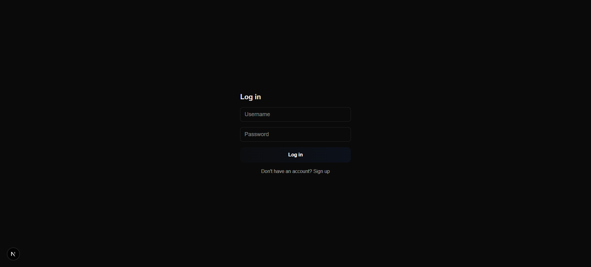
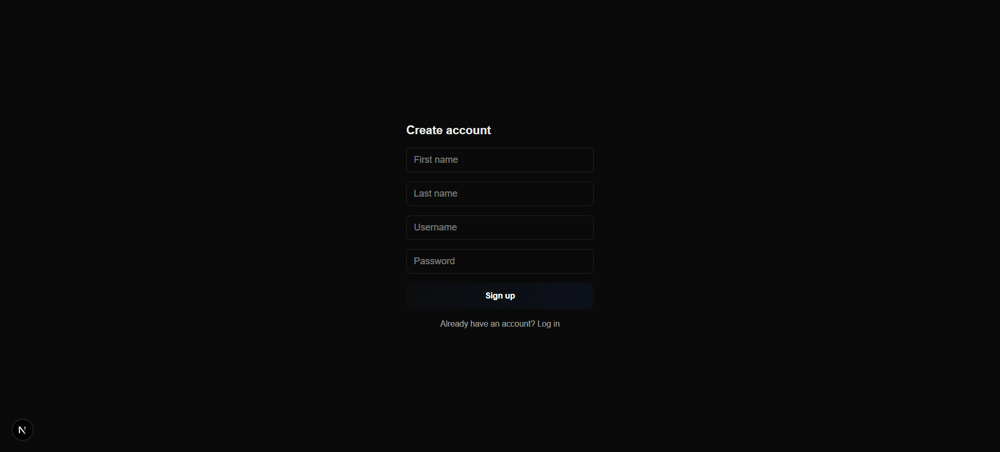
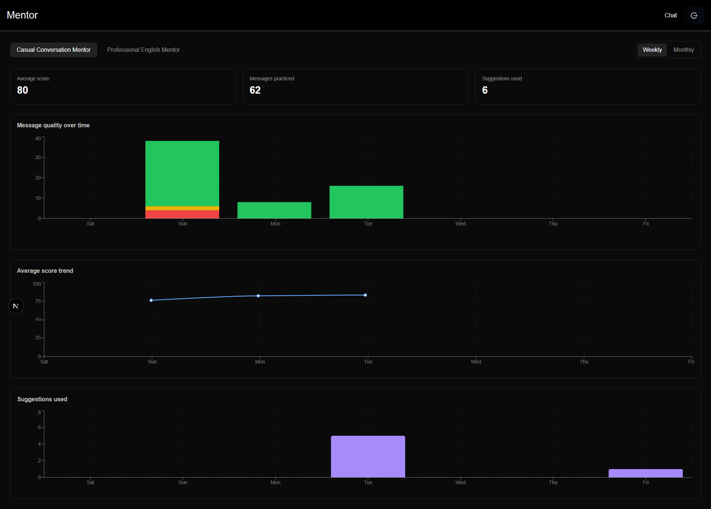
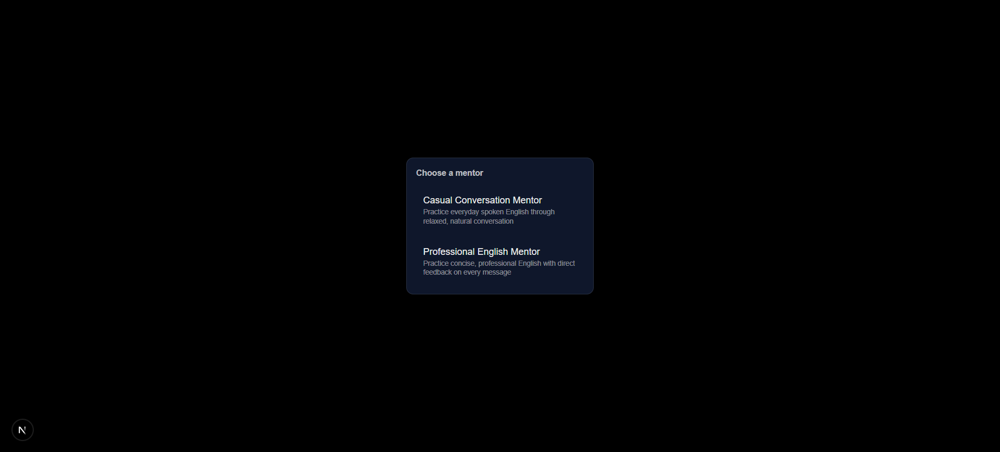
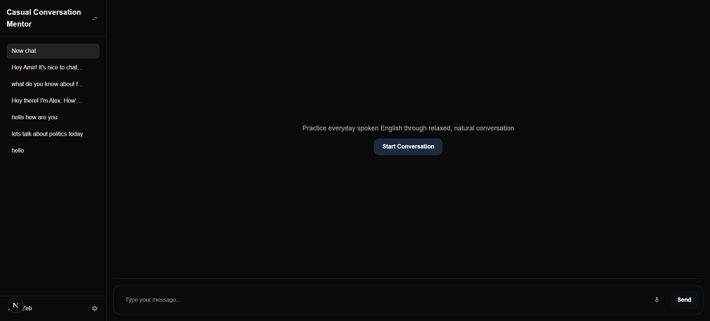
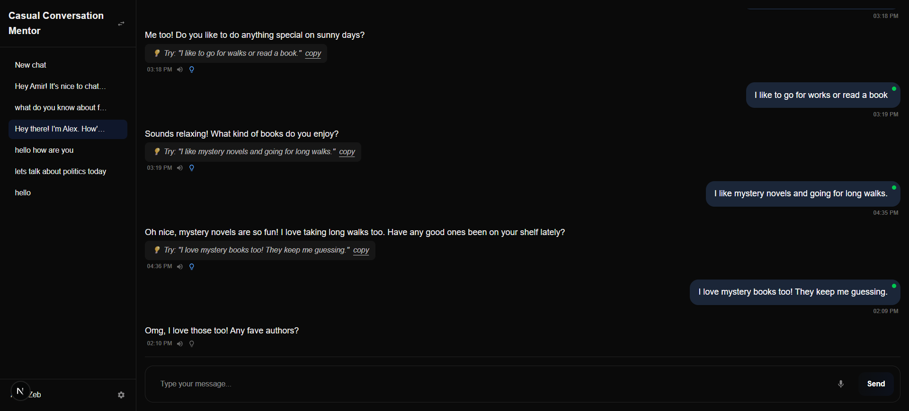
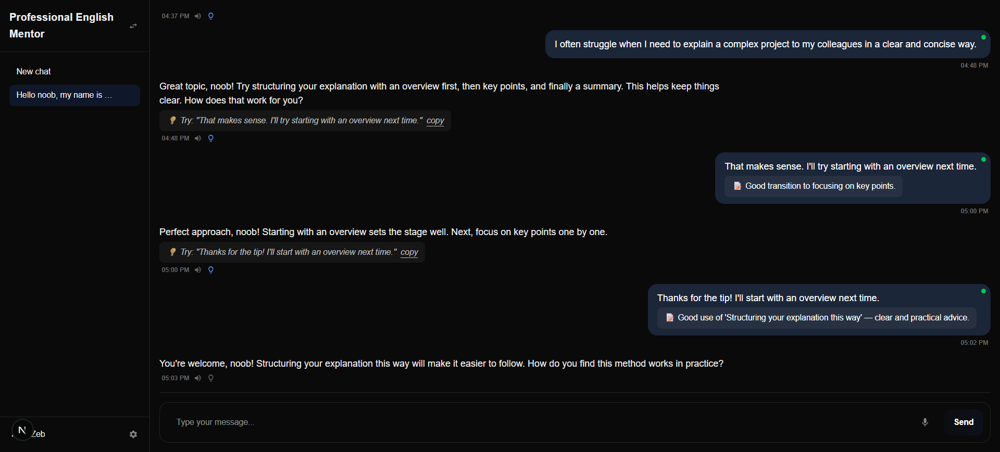

# AI English Mentor

A conversational English-practice app powered by a **local LLM** (via [Ollama](https://ollama.com/)) — no cloud AI API, no per-message cost, and no data leaving your machine. Chat with an AI mentor, get a live fluency score on every message, and track your progress over time.

----------

## Why I built this

I wanted a hands-on project to learn how to build real, full-stack AI features — not just call a hosted API and forward the response, but actually design the prompt engineering, structured output handling, and UX around an LLM that runs entirely on my own laptop. This project doubles as:

-   A practical way to practice **local LLM integration** (Ollama, structured/schema-constrained output, prompt design)
-   A **learning project for full-stack Next.js** (App Router, server components, auth, MongoDB)
-   A genuinely useful tool — casual and professional English conversation practice with instant, private feedback

----------

## What the app does

The app connects you with an AI "mentor" for open-ended conversation practice. Every message you send is scored for grammar/fluency, mentors can react and continue the conversation naturally, and you can review your progress on a dashboard.

### Core modules

**Conversations**

-   Multiple mentors, each with a distinct persona and conversation style
-   Full conversation history, persisted per user, browsable and resumable
-   "Start Conversation" — the mentor picks a topic and opens with a question, so you never face a blank page
-   Delete conversations you no longer need

**Mentors**
| Mentor | Persona | Style |
|--|--|--|
| Casual Conversation Mentor | Ali | Relaxed, friendly, everyday topics. Never corrects you — built purely to build speaking confidence. |
| Professional English Mentor | Ahmed | Concise, workplace-oriented. Gives direct feedback (grammar, word choice, tone) on every message. |

**Scoring & feedback**

-   Every user message is scored 0–100 on sentence structure and grammar (spelling/typos are never penalized)
-   A colored indicator (🔴🟡🟢) shows the score at a glance on each message
-   The Professional mentor adds a short written feedback note under each message

**Help / suggestions**

-   Stuck on how to reply? A "suggest a reply" button generates one example response in your voice, so you're never blocked from continuing the conversation

**Voice**

-   **Speech-to-text** — speak your message instead of typing (Chrome only)
-   **Text-to-speech** — hear any mentor reply via a per-message speaker button, or enable auto-speak so every new reply is read aloud automatically
-   Preference is saved locally and persists across sessions

**Dashboard**

-   Weekly and monthly views of your practice activity, per mentor
-   Stacked column chart of message quality (score bands) over time
-   Average score trend line
-   Suggestion-usage tracking (a proxy for how independently you're conversing over time)

**Accounts**

-   Simple username/password authentication (first name, last name, username, password)
-   Each user's conversations, scores, and stats are private to their account

----------
## Screenshots 
### Login
  
### Signup
 
### Dashboard
 
### Chat Screen (Mentor Selection)
 
### Chat Screen 
 
 
 
 
----------

## Tech stack

-   **Framework:** Next.js (App Router), TypeScript
-   **AI:** [Ollama](https://ollama.com/), running `qwen2.5:7b` locally, with schema-constrained JSON output for reliable structured responses
-   **Database:** MongoDB + Mongoose
-   **Auth:** Custom JWT-based auth (`jose`), httpOnly cookies, `bcryptjs` for password hashing
-   **UI:** Tailwind CSS, `sonner` (toasts), `react-icons`, `recharts` (dashboard charts)
-   **Voice:** Web Speech API (`SpeechRecognition` / `SpeechSynthesis`) — browser-native, Chrome only
-   **Docs:** Swagger (`/api-doc`) for API reference

----------

##  Architecture overview

The app is split into clear layers, each with one responsibility — this keeps the AI/DB logic swappable (e.g. Ollama → a hosted API) without touching UI code, and keeps components free of fetch/business logic.

``` 
Client components (Chat, DashboardClient, forms)
			│ call
			▼
Service layer (lib/services/*)
			│ thin fetch wrappers — no logic, just request/response
			▼
API routes (app/api/*)
			│ validate input, enforce ownership, orchestrate
			▼
Domain layer (lib/mentors, lib/aiProvider, lib/models, lib/auth)
			│
			▼
MongoDB (persistence) + Ollama (local LLM)
```

**Client components** hold only UI state (messages, active conversation, toggles) and call **service functions** — never `fetch` directly. This means a component never knows or cares whether data comes from an API route, a cache, or somewhere else.

**Services** (`lib/services/*`) are deliberately dumb: one function per request, no business logic, just building the request and throwing a clean error on failure. Components decide how to surface that error (toast, inline state, etc).

**API routes** (`app/api/*`) are where real logic lives: reading the authenticated `userId` (injected by `proxy.ts`, see below), validating ownership of the resource being touched, and coordinating calls to the domain layer.

**The domain layer** is where the interesting pieces are isolated:

- `lib/mentors/` — each mentor's persona, system prompt, opener, and suggestion prompt in one place, so adding a new mentor never touches route code
- `lib/aiProvider/ollama.ts` — the only file that talks to Ollama; handles schema-constrained structured output and defensive parsing, so a future swap to a different LLM provider is a single-file change
- `lib/models/` — Mongoose schemas, the single source of truth for stored shapes
- `lib/auth/` — JWT signing/verification and password hashing, used by both API routes and server components

**`proxy.ts`** sits in front of every protected route and page. It verifies the JWT once, then injects the resolved `userId` as a request header (`x-user-id`) — so route handlers never re-implement auth, they just read the header.

**One deliberate exception:** the `/dashboard` page is a **server component** that calls the stats aggregation function directly (`lib/stats/getDashboardStats`), skipping the service/API-route layers entirely. Since it's a one-time server-rendered read with no live interactivity, going through a full client-fetch round trip would add complexity for no benefit — the mentor/range toggles on that page just re-slice data that's already loaded, with no further network calls.

----------

## System requirements

This project is designed to run entirely on a normal consumer laptop — no GPU required.

**Minimum (tested configuration):**

-   CPU: 4-core (e.g. Intel i7-8565U or equivalent)
-   RAM: 16 GB (Ollama running `qwen2.5:7b` uses ~11 GB while active)
-   Storage: ~5 GB free for the model, plus space for MongoDB data
-   OS: Windows, macOS, or Linux — anywhere Ollama and Node.js run

**Software:**

-   [Node.js](https://nodejs.org/) 18+
-   [Ollama](https://ollama.com/) installed, with the `qwen2.5:7b` model pulled
-   MongoDB (local instance or a free [Atlas](https://www.mongodb.com/atlas) cluster)
-   **Google Chrome** — required for the voice features (speech recognition support is inconsistent in other browsers)

----------

## Getting started

### 1. Clone and install

```bash
git clone https://github.com/Amir-zeb/ai-english-mentor
cd ai-english-mentor
npm install

```

### 2. Install and prepare Ollama

```bash
ollama pull qwen2.5:7b

```

Make sure Ollama is running (it typically starts automatically after install, or run `ollama serve`).

### 3. Environment variables

Create a `.env.local` file in the project root:

```env
MONGODB_URI=mongodb://localhost:27017/ai-english-mentor
JWT_SECRET=your-random-secret-string
OLLAMA_URL=http://localhost:11434
OLLAMA_MODEL=qwen2.5:7b

```

Generate a secure `JWT_SECRET` with:

```bash
node -e "console.log(require('crypto').randomBytes(32).toString('hex'))"

```

### 4. Run the app

```bash
npm run dev

```

Visit `http://localhost:3000`, sign up for an account, and start a conversation.


###  5. (Optional) Run with Docker

The app can also run in a container while MongoDB and Ollama stay on your host machine.


**In `.env.local`, point Mongo and Ollama at the host machine instead of `localhost`:**

```env

MONGODB_URI=mongodb://host.docker.internal:27017/ai-english-mentor
OLLAMA_URL=http://host.docker.internal:11434

```

`host.docker.internal` is how a container reaches services running on your host — `localhost` inside a container refers to the container itself, not your machine. `extra_hosts: host-gateway` makes this hostname resolve correctly across Windows, macOS, and Linux.

Build and run:

```bash

docker build -t ai-english-mentor:latest .

docker compose up -d

```

----------

## Project structure
  
```
├─ app
│  ├─ api
│  │  ├─ auth
│  │  │  ├─ login/route.ts
│  │  │  ├─ logout/route.ts
│  │  │  ├─ me/route.ts
│  │  │  └─ signup/route.ts
│  │  ├─ chat
│  │  │  ├─ route.ts
│  │  │  ├─ start/route.ts
│  │  │  ├─ suggest/route.ts
│  │  │  └─ test/route.ts
│  │  └─ conversations
│  │     ├─ route.ts
│  │     └─ [id]/route.ts
│  ├─ api-doc                    # Swagger API reference UI
│  │  ├─ page.tsx
│  │  ├─ react-swagger.tsx
│  │  └─ swagger-docs-client.tsx
│  ├─ chat/page.tsx              # main chat screen
│  ├─ dashboard/page.tsx         # progress/stats dashboard
│  ├─ login/page.tsx
│  ├─ signup/page.tsx
│  ├─ layout.tsx
│  └─ page.tsx
├─ components
│  ├─ chat
│  │  ├─ chat.tsx
│  │  ├─ chatForm.tsx
│  │  ├─ chatListItem.tsx
│  │  ├─ chatMessage.tsx
│  │  ├─ chatSidebar.tsx
│  │  ├─ chatSideBarFooter.tsx
│  │  ├─ chatSideBarHeader.tsx
│  │  ├─ mentorSelectModal.tsx
│  │  └─ typingIndicator.tsx
│  ├─ dashboard/dashboardClient.tsx
│  ├─ header/header.tsx
│  └─ loader/loader.tsx
├─ lib
│  ├─ aiProvider/ollama.ts       # Ollama integration + structured output parsing
│  ├─ auth
│  │  ├─ AuthContext.tsx
│  │  ├─ getUserId.ts            # client + server userId helpers
│  │  ├─ jwt.ts
│  │  └─ password.ts
│  ├─ db/connect.ts
│  ├─ hooks
│  │  ├─ useAutoSpeakPreference.ts
│  │  ├─ useSpeechRecognition.ts
│  │  └─ useSpeechSynthesis.ts
│  ├─ mentors
│  │  ├─ config.ts               # mentor definitions
│  │  └─ prompts
│  │     ├─ casualMentor.ts
│  │     └─ professionalMentor.ts
│  ├─ models
│  │  ├─ ConversationHistory.ts
│  │  ├─ Messages.ts
│  │  └─ User.ts
│  ├─ services
│  │  ├─ auth.service.ts
│  │  ├─ chat.service.ts
│  │  └─ conversations.service.ts
│  ├─ stats/getDashboardStats.ts
│  ├─ swagger/swagger.ts
│  ├─ constant.ts
│  └─ types.ts
├─ public
├─ LICENSE
├─ proxy.ts                      # auth gate (route + page protection)
└─ README.md
```

----------

## Known limitations

-   Runs entirely on CPU inference — expect a few seconds' delay per reply on modest hardware.
-   Voice features are Chrome-only (Web Speech API support elsewhere is unreliable).
-   Auth is intentionally minimal (no email verification, password reset, or OAuth) — this app prioritizes learning and functionality over production-grade security.

----------
  
##  License

`MIT — see [LICENSE](./LICENSE) for details.`

----------
##### Develop by **Amir Zeb**.